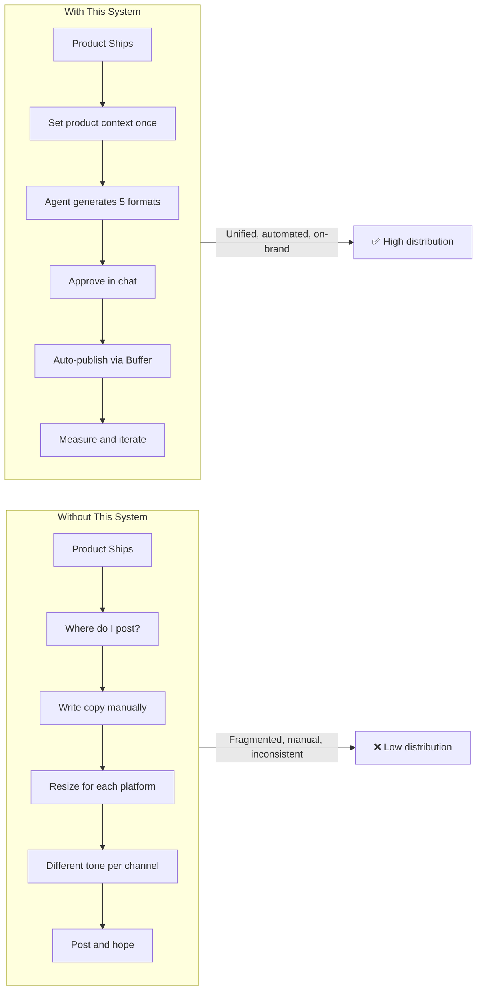
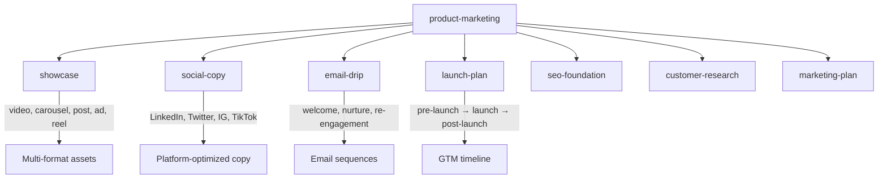
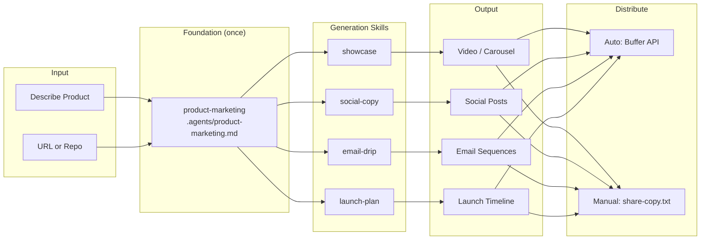

# Another Marketing Skills

[](LICENSE)
[](VERSION)
[](skills/)
[](HEALTH-CHECK.md)
[](https://github.com/juandelossantos/another-marketing-skills/actions)
[](CONTRIBUTING.md)
[](https://opencode.ai)

**You built it. Now promote it.**

AI agent skills that research, create, and distribute promotional content — video, carousel, social posts, email sequences, and launch plans — with the same mechanical discipline that [another-agent-skills](https://github.com/juandelossantos/another-agent-skills) brings to software engineering.

> Designed for [**OpenCode**](https://opencode.ai) first. Portable to Claude Code, Cursor, Codex CLI, Gemini CLI, and any agent via AGENTS.md.

---

## Quick Start

```bash
# Clone the skills
git clone https://github.com/juandelossantos/another-marketing-skills.git
cd another-marketing-skills

# Set up product context (required before any generation skill)
# Ask your agent: "set up product context for my project"
```

Your agent reads `AGENTS.md` automatically. The `product-marketing` skill creates `.agents/product-marketing.md` — one source of truth for all generation skills.

### Install as OpenCode Plugin

```
/plugin marketplace add juandelossantos/another-marketing-skills
/plugin install another-marketing-skills
```

### Manual Install (any agent)

```bash
# Symlink skills to agent discovery path
ln -s "$PWD/skills/product-marketing" .opencode/skills/product-marketing   # OpenCode
ln -s "$PWD/skills/product-marketing" .agents/skills/product-marketing      # Codex CLI / universal
ln -s "$PWD/skills/product-marketing" .claude/skills/product-marketing      # Claude Code
```

---

## The Problem

Marketing tools are fragmented. Each platform (LinkedIn, Twitter, email, video) has its own rules, formats, and APIs. Developers who ship great products struggle to promote them because marketing is a different discipline.



---

## Skills

### Current

| Skill | Status | What It Does | Depends On |
|-------|--------|-------------|------------|
| `product-marketing` | ✅ v0.1 (draft) | Creates `.agents/product-marketing.md` — shared context for all skills | None |

### Planned (Fase 1-3)



---

## How It Works



### The Promotion Flywheel

```
Research → Create → Distribute → Measure → Iterate
Every skill follows this cycle. The agent does the work. The human approves.
```

---

## Agent Compatibility

| Feature | OpenCode | Claude Code | Codex CLI | Cursor | Gemini CLI | Any Agent |
|---------|----------|-------------|-----------|--------|------------|-----------|
| SKILL.md auto-discovery | ✅ native | ⚠️ symlink | ✅ symlink | ⚠️ custom | ⚠️ custom | ⚠️ manual |
| Guardian Pattern | ✅ full | ✅ full | ✅ partial | ✅ partial | ✅ partial | ✅ partial |
| Skill gates | ✅ native | ⚠️ manual | ⚠️ manual | ⚠️ manual | ⚠️ manual | ⚠️ manual |
| Distribution auto-publish | ✅ via Buffer API | ⚠️ manual | ⚠️ manual | ⚠️ manual | ⚠️ manual | ⚠️ manual |

**Recommended:** OpenCode for full mechanical enforcement. Other agents work via AGENTS.md rules.

---

## Design Philosophy

| Principle | What It Means |
|-----------|---------------|
| **Generation is solved. Distribution is the bottleneck.** | AI can write copy. Getting it to the right platform in the right format is the hard part. |
| **Copy is craft, not prompting.** | Marketing copy requires research, audience understanding, and persuasion psychology — not template-filling. |
| **Multi-format from one input.** | Describe once. Get video, carousel, social post, email, and launch plan. |
| **The agent works. The human decides.** | Never publish without approval. Guardian Pattern applies to marketing too. |
| **Quality over quantity.** | 8 skills that ship beats 45 that advise. Every skill produces a distributable asset. |
| **Mechanical enforcement.** | Brand voice, platform rules, readability, and persuasion structure are checked by gates — not left to judgment. |

Read the full philosophy in [`SOUL.md`](SOUL.md).

---

## What Makes This Different

| Dimension | Generic AI Marketing | marketingskills (45 skills) | **another-marketing-skills** |
|-----------|-------------------|---------------------------|---------------------------|
| **Output** | Advisory text | Advisory ("here's advice") | **Generative (finished assets)** |
| **Formats** | Single per tool | Single per skill | **Multi-format from one input** |
| **Distribution** | None | None | **Auto (Buffer API) + Manual (copy-paste)** |
| **Quality** | No gates | Eval system | **Eval + mechanical gates + brand voice audit** |
| **Context discipline** | None | 600+ line skills | **SKILL.md <250 lines, lazy-loaded references** |
| **Enforcement** | None | Validation scripts | **Full Guardian Pattern + gates** |
| **Audience** | Everyone | Technical marketers | **Developers + non-developers (dual mode)** |

---

## Project Structure

```
another-marketing-skills/
├── AGENTS.md                # Agent instructions (universal)
├── SOUL.md                  # Project identity
├── SPEC.md                  # Project specification
├── DESIGN.md                # Visual design tokens
├── HEALTH-CHECK.md          # Project state tracker
├── .gitignore
├── VERSION
├── scripts/                 # Enforcement scripts (8 gates)
│   ├── skill-lint.sh        # Validate skill structure
│   ├── skill-gate.sh        # Register skill consultation
│   ├── edit-guard.sh        # File integrity protection
│   └── ...
├── skills/                  # Marketing skills
│   └── product-marketing/   # Foundation context skill
├── design/                  # Design lock + tokens
├── rules/                   # Enforcement rules
└── development/             # Dev artifacts (gitignored)
```

---

## Status

- **Current version:** 0.1.0
- **Skills shipped:** 1 (product-marketing, draft)
- **Planned skills:** 8 total across 4 fases
- **Infrastructure:** install.sh + install.ps1, eval system, multi-agent symlinks ✅
- **Landing page:** Deferred until 2+ skills (Fase 1b)
- **Eval tests:** 4/4 trigger pass, full coverage

See [`HEALTH-CHECK.md`](HEALTH-CHECK.md) for full project state.

---

## Contributing

Open an issue or PR. Focus on the promotion flywheel — research, create, distribute, measure, iterate. No CRO, no ads management, no pricing skills.

See [`CONTRIBUTING.md`](CONTRIBUTING.md) (coming) for skill creation guidelines.

---

## License

MIT © 2026 juandelossantos

Built on the mechanical discipline of [another-agent-skills](https://github.com/juandelossantos/another-agent-skills).
