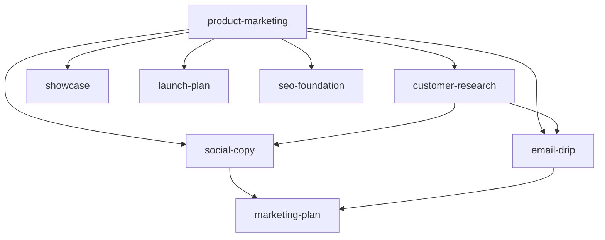
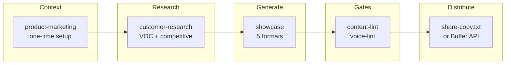

# Another Marketing Skills

[](LICENSE)
[](VERSION)
[](skills/)
[](HEALTH-CHECK.md)
[](https://github.com/juandelossantos/another-marketing-skills/actions)
[](CONTRIBUTING.md)
[](https://opencode.ai)

**You built it. Now promote it.**

AI agent skills that research, create, and distribute promotional content — video, carousel, social posts, email sequences, and launch plans — with the same mechanical discipline that [another-agent-skills](https://github.com/juandelossantos/another-agent-skills) brings to software engineering.

> Designed for [**OpenCode**](https://opencode.ai) first. Portable to Claude Code, Cursor, Codex CLI, Gemini CLI, and any agent via AGENTS.md.

---

## Quick Start

```bash
# Clone + install
git clone https://github.com/juandelossantos/another-marketing-skills.git
cd another-marketing-skills
bash install.sh --agent all

# Set up product context (required before any generation)
# Ask your agent: "set up product context for my project"
```

Your agent reads `AGENTS.md` and discovers skills automatically via symlinks at `.opencode/skills/`, `.agents/skills/`, and `.claude/skills/`.

### Windows

```powershell
git clone https://github.com/juandelossantos/another-marketing-skills.git
cd another-marketing-skills
.\install.ps1 -Agent all
```

> **Note:** On Windows, clone with `git clone -c core.symlinks=true` for symlink support.

---

## Skills

### Current

| Skill | Status | What It Does |
|-------|--------|-------------|
| `product-marketing` | ✅ v1.0 (active) | Creates `.agents/product-marketing.md` — shared context for all skills |
| `customer-research` | ✅ v1.0 (active) | VOC extraction, competitive analysis, persona generation, confidence-scored research |
| `showcase` | ✅ v1.0 (active) | 5-format generator: video, carousel, reel, social post, ad copy. Mechanical quality gates |

### Planned



---

## Mechanical Enforcement

Every skill has a corresponding gate script that blocks the agent from proceeding without user input and quality verification:

| Gate | Blocks | What it enforces |
|------|--------|-----------------|
| `research-gate.sh` | Extraction | User must answer 4 questions before research |
| `showcase-gate.sh` | Generation | User must answer 7 questions before creating |
| `content-lint.sh` | Distribution | Output must pass banned words, CTA, length, audio checks |
| `voice-lint.sh` | Distribution | Output must match brand voice from product-marketing.md |

---

## How It Works



**The Promotion Flywheel:** Research → Create → Distribute → Measure → Iterate

---

## Agent Compatibility

| Feature | OpenCode | Claude Code | Codex CLI | Any Agent |
|---------|----------|-------------|-----------|-----------|
| SKILL.md discovery | ✅ native | ✅ symlink | ✅ symlink | ⚠️ manual |
| Mechanical gates | ✅ full | ✅ full | ✅ partial | ✅ partial |

---

## Project Structure

```
another-marketing-skills/
├── AGENTS.md                   # Agent instructions (universal)
├── install.sh / install.ps1    # Cross-platform installers
├── scripts/
│   ├── content-lint.sh         # Banned words, CTA, platform limits, audio
│   ├── voice-lint.sh           # Brand voice compliance
│   ├── showcase-gate.sh        # Mandatory 7-question interview
│   ├── research-gate.sh        # Mandatory 4-question interview
│   ├── eval/                   # Eval runners (trigger, golden, adversarial)
│   └── ...                     # Lint, gate, guard scripts
├── skills/
│   ├── product-marketing/      # Foundation context
│   ├── customer-research/      # VOC extraction + analysis
│   └── showcase/               # Multi-format generator
└── development/                # Dev artifacts (gitignored)
```

## Status

- **Version:** 0.1.0
- **Skills shipped:** 3 (all active)
- **Planned:** 8 total across 4 fases
- **Mechanical gates:** 4 scripts enforcing user interaction + quality
- **Eval tests:** 12/12 pass, full coverage all skills
- **Install:** install.sh (Linux/macOS) + install.ps1 (Windows)

---

## License

MIT © 2026 juandelossantos

Built on [another-agent-skills](https://github.com/juandelossantos/another-agent-skills).
